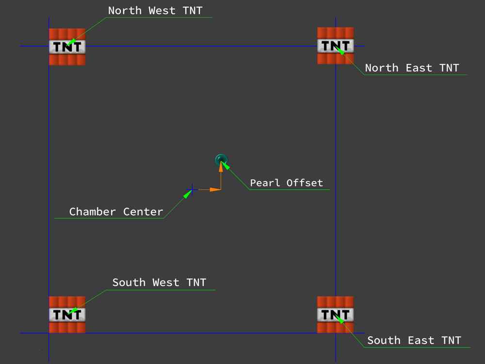

# PearlCalculatorCore

只是一個珍珠計算器核心計畫的嘗試而已。

[English](README.md) | [简体中文](README zh-CN.md)

# Bug回報規則

1. 所有的回報須在Github的Issue頁面提交；
2. 回報者須親身經歷此問題；

若 回報/回報者 違反以上內容，該報告將不予考慮。

# 前置

在前往下個頁面前，請先安裝`dotnet Core運行時`。

- dotnet Core 3.1 (Link: https://dotnet.microsoft.com/download)

# PearlCalculatorCP

這是一個基於[AvaloniaUI](https://github.com/AvaloniaUI/Avalonia)跨平台前端軟體，可用於輸入參數及顯示結果。

## 支持語言

- English
- 繁體中文
- 简体中文

如果你想為此軟體提供語言支持，可通過Github的`Pull requests`並於[PearlCalculatorCP/Assets/i18n/](PearlCalculatorCP/Assets/i18n/)文件夾中提供一份json格式的翻譯文件。

## 安裝指引

### Windows

使用命令列執行`cpbuild.ps1`。

```powershell
> cpbuild.ps1
```

### macOS, Linux

使用終端機運行`cpbuild.sh`，你可能需要在執行此指令碼(腳本)前修改文件權限，例如`chmod +x cpbuild.sh`。

```powershell
sh cpbuild.sh
```

## PearlCalculatorCP 命令列引數

```
options:
    -scale [ratio]      可以基於顯示器的DPI調整軟體大小 (e.g: PearlCalculatorCP -scale 1.25)
```

## 提示

- 你可以使用地毯(`Carpet`)模組`/log tnt`指令取得TNT的爆炸座標；
    - 小心被該指令的洗版；
- 你可以利用軟體正上方的選項功能(三個點)調整一下參數；
    - 調整語言參數；
        - 若重複選擇相同語言參數會將其設為語言語言；
    - 軟體開啟時預設載入的設定文件；
- 此軟體`不會`對TNT與珍珠之間的距離作確認，若兩者之間的距離超出限制，可能會導致此軟體出現錯誤結果或例外異常；
- 計算時得出的`方向`與`角度`將會被顯示在軟體的右下角；
- 於`通用FTL`下的`一般設定`頁面中：
    - 你需要先對珍珠的座標四捨五入再將其輸入到`珍珠座標`中：
    - 你可以將當前的參數保存成一份設定檔，此設定檔可用於多個用途例如保存某個 伺服器/設計 的珍珠砲的預設參數或者將當前的結果分享給伺服器成員；
        - 你可以為你的設定取一個適合的名字；
- 於`通用FTL`下的`進階設定`頁面中：
    - 珍珠矯正偏差指珍珠與珍珠砲膛室之間的偏差(珍珠 - 珍珠砲膛室)：
    - 於`計算結果排序參數`中：
        - 滑條可用於調整TNT的權重；
        - 單選按鈕可用於調整排序方法；
- 於`通用FTL`下的`更多基礎設定`頁面中：
    - TNT參數側邊的開關需被啟用才能改變TNT的參數，其用途是為了防止任何意料之外的修改；
    - X和Z軸都是相對於`珍珠砲膛室`的相對座標；
    - `預設紅色TNT方位`和`預設藍色TNT方位`必須是複合方位且成對角關係；
- 在`結束輸出`頁面中，如果當前狀態是顯示TNT配比，你可以點選`距離偏離`、`遊戲刻`和`總量`來調整排序，數值較小者為優先；
- 在`自訂義FTL`頁面中：
    - 全部的參數都在全局座標系下；
    - 你可以輸入最多兩組TNT參數；
    - 如果此軟體無法找出任何可能的TNT配比，此軟體`不會`發出任何提示；

# PearlCalculatorLib

## General

所有在這個名稱空間下的類都是用於計算常規的360度珍珠砲，無法處理只有部分方向的珍珠砲。

- ### [Data](PearlCalculatorLib/General/Data.cs)

    這個類的用意是為了保存大部分的參數，如果必要得參數並非正確，[Calculation](PearlCalculatorLib/General/Calculation.cs)類中計算的結果將會錯誤，甚至有可能會觸發異常。下表羅列了每個參數的注意事項和所對應的算法，如果下方並未顯示所對應的方法，預設則會是`CalculateTNTAmount`、`CalculatePearlTrace`和`CalculateTNTVector`。

    ### 需要被填充的參數

    1. `TNT`
        - TNT爆炸的座標
        - X和Z軸需是相對於膛室的局部座標
        - Y軸需是全局座標
    2. `Destination`
        - 目的地座標
        - 被使用於`CalculateTNTAmount`方法
    3. `Pearl`
        - 珍珠的動能(請使用`.WithVector()`方法)
        - 珍珠的座標(請使用`.WithPosition()`方法)
        - 珍珠的座標需被四捨五入
    4. `PearlOffset`
        - 珍珠的真實距座標於上述座標之間的偏移
    5. `BlueTNT`和`RedTNT`
        - 珍珠砲的TNT配比
        - 未對應任何算法，可用於保存TNT配比
    6. `TNTWeight`
        - 用於排序
        - 0~100之間的整數
        - 數值越高代表TNT數量越多的結果會被顯示在上排
        - 被使用於[TNTCalculationResultSortComparerByWeighted](PearlCalculatorLib/PearlCalculationLib/Result/TNTCalculationResultSortComparerByWeighted.cs)類中
    7. `MaxTNT`
        - 珍珠砲的最大TNT數量(取其中一邊)
        - 被使用於`CalculateTNTAmount`
    8. `MaxCalculateTNT`, `MaxCalculateDistance`
        - 請留空
    9. `Direction`
        - 指示珍珠的飛行方向(只允許四大方位)
        - 被使用於`CalculatePearlTrace`
    10. `DefaultRedDuper`和`DefaultBlueDuper`
        - 只允許複合方位
        - 用於指示TNT在膛室內的方位
    11. `TNTResult`
        - 用於輸出/保存計算結果
        - 包含以下內容
            - 珍珠的飛行時間
            - 紅色TNT配比
            - 藍色TNT配比
            - 落點偏差
            - TNT總量(紅色TNT配比 + 藍色TNT配比)

    #### 備註

    對於Y軸座標，所有參數都是全局座標，但是，對於`TNT`和`珍珠偏離`參數的X和Z軸座標都是相對於`珍珠座標`(既PCCSettingsGenerator的`珍珠砲膛室`)的參數，詳情請參閱下圖。

    

    ### [Calculation](PearlCalculatorLib/General/Calculation.cs)

    這個類含有四個公開API組成，這些方法負責了大部分的運算，不同的方法具備了不同的功能，詳情可以查看檔批註，對於他們所需要的部分參數，請查閱[Data](PearlCalculatorLib/General/Data.cs)目錄下的內容。

    1. `CalculateTNTAmount` 可用於計算TNT配比並且返回一個`bool`值指示計算的成功性。而計算出的TNT配比將會被保存在[Data](PearlCalculatorLib/General/Data.cs)類中的`TNTResult`；

    2. `CalculatePearlTrace`可用於模擬珍珠的軌跡，計算出的結果將會保存為一個`List<PearlEntity>`；

    3. `CalculateTNTConfiguration`可用於協助使用者編碼珍珠砲，此算法可通過填入與珍珠砲配置區相同的參數，計算出編碼結果；

    4. `CalculateTNTVector`可用於計算由TNT施加給TNT的矢量，對於詳細的資訊，請參閱檔批註；

    ### [Settings](PearlCalculatorLib/General/Settings.cs)

    這個類只做為數據結構並用於json檔案的序列化與反序列化。

## Manually

這個名稱空間下的內容與`PearlCalculatorLib.General`名稱空間下的內容相似，不同之處在於此名稱空間下的輸入輸出皆為全局座標。

## PearlCalculationLib

這個名稱空間下的內容用於為其他的類提供底層API做複雜運算。

- ### AABB

    這個名稱空間保留做未來開發。

- ### Entity, MathLib, Utility

    這些名稱空間用於提供實用工具。

- ### Result

    這個名稱空間用於處理TNT配比，其中的排序方法可以根據`TNT總量`、`遊戲刻`和`距離`進行。

- ### World

    這個名稱空間用於提供對世界座標和方向的處理。

- ### [VectorCalculation](PearlCalculatorLib/PearlCalculationLib/VectorCalculation.cs)

    這個類的目的是通過給予TNT和珍珠的座標，計算TNT對珍珠造成的加速度。請注意，此算法不會處理**Mojang**設置的TNT爆炸距離限制，如果距離超過了該限制，此算法將會返回錯誤的結果，甚至可能會觸發異常。

# PCCSettingsGenerator (文件夾名稱 : PCCSettingsCalculator)

這個項目用於協助珍珠砲設計者更簡便地生成設定檔，通過填入從遊戲中獲取的參數，此軟體可將輸入的數據成json格式的設定檔且用於`PearlCalculatorCP`的使用。

## 支持語言

- 英文(English)
- 繁體中文
- 簡體中文(简体中文)

如果你想為此軟體提供語言支持，可通過Github的`Pull requests`並於[PCCSettingsCalculator/Resources/](PCCSettingsCalculator/Resources/)文件夾中提供一份resx格式的翻譯文件。

# PearlCalculatorWFA

這個軟體更多的用語珍珠砲的偵錯中，軟體內已集成了許多使用的指令用語查看及修改隱藏參數，請注意，此軟體並`不支持`除了`英文`以外的語言及此軟體的維護鮮少進行。

# PearlCalculatorCore

這個軟體只用於偵錯用途，並非提供給任何人去使用。