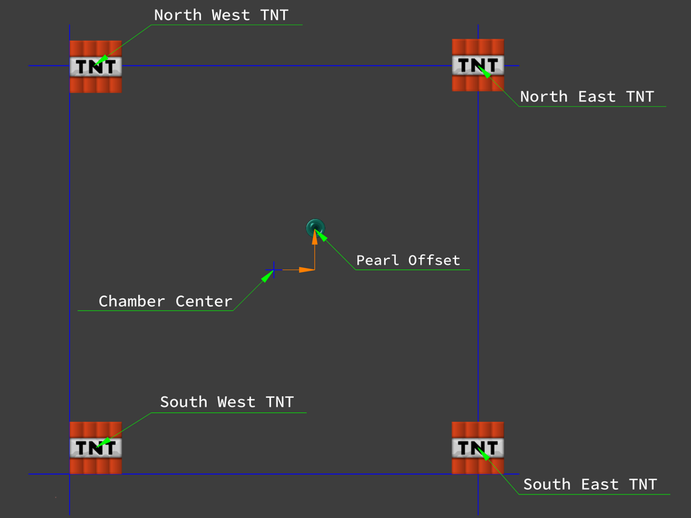

# PearlCalculatorCore

只是一个珍珠计算器核心计划的尝试而已。

[English](README.md) | [繁體中文](README_zh-TW.md)

# Bug报告规则

1. 所有报告者须在Github的Issues中报告；
2. 报告者须亲身发现此问题；

若 报告/报告者 违反以上内容，该报告将不被考虑。

# 前置

在运行本仓库的所有软件前，请先安装`dotnet Core`运行时

- [dotnet Core 3.1](https://dotnet.microsoft.com/download/dotnet/3.1)

# PearlCalculatorCP

这是一个基于[AvaloniaUI](https://github.com/AvaloniaUI/Avalonia)的跨平台前端，可用于输入参数及展示结果。

## 支持语言

- English
- 繁體中文
- 简体中文

## 如何安装

1. 前往 [Release](https://github.com/LegendsOfSky/PearlCalculatorCore/releases) 下载最新版本

2. 从源代码编译/构建

    -  克隆此仓库

        ```
        git clone https://github.com/LegendsOfSky/PearlCalculatorCore.git
        ```
        
    - 构建此项目(Windows)
      
      ```powershell
      cd PearlCalculatorCore
      cpbuild.ps1
      ```
      
    - 构建此项目(macOS, Linux)
    
        ```sh
        cd PearlCalculatorCore
        cpbuild.sh
        ```
    
        > 您可能需要在运行此脚本前赋予脚本执行权限，请运行`chmod +x cpbuild.sh`。

## PearlCalculatorCP 运行参数

```
options:
    -scale [ratio]      基于当前屏幕DPI缩放软件大小 (e.g: PearlCalculatorCP -scale 1.25)
```

## 提示

- 你可以使用地毯(Carpet)模组`/log tnt`指令获取TNT的爆炸坐标；
    - 小心该指令的洗版；
- 你可以利用软件正上方的选项功能(三个点)调整部分软件参数；
    - 切换语言；
        - 若重复选择相同语言会将其设置为软件的默认语言；
    - 软件开启时预设载入的配置文件；
- 此软件**不会**对TNT与珍珠之间的距离做确认，若两者之间的距离超出限制，可能会导致软件出现错误结果或产生异常；
- 在`通用FTL`下的`一般选项`页面中：
    - 你需要先对珍珠的坐标四舍五入再将其输入到`珍珠坐标`中：
    - 你可以将当前的参数保存为一份配置文件，此配置文件可用于多个用途，例如保存某个 服务器/设计 的珍珠炮的预设参数或者将当前的结果分享给服务器成员；
- 在`通用FTL`下的`进阶选项`页面中：
    - 珍珠矫正偏移指珍珠与珍珠炮膛室之间的偏差(珍珠 - 珍珠炮膛室)：
    - 在`计算结果排序参数`中：
        - 滑条可用于调整TNT的权重；
        - 单选按钮可用于调整排序方法；
- 在`通用FTL`下的`更多基础选项`页面中：
    - TNT参数侧边的开关需被启用才能修改TNT的参数，其用途是为了防止任何意料之外的修改；
    - X和Z轴都是相对于`珍珠炮膛室`的相对坐标；
    - `预设红色TNT方位`和`预设蓝色TNT方位`必须是复合方位且成对角关系；
- 在`结果输出`页面中，如果当前状态为显示TNT配比，你可以点选`距离偏移`、`游戏刻`和`总量`来调整排序，数值较小者优先；
- 在`自定义FTL`页面中：
    - 全部的参数都在全局坐标系下；
    - 你可以输入最多两组TNT参数；
    - 如果此软件无法找出任何可能的TNT配比，此软件**不会**发出任何提示；

# PearlCalculatorLib

## General

所有在这个名称空间下的类都是用于计算常规的360度珍珠炮，无法处理的只有部分方向的珍珠炮。

- ### [Data](PearlCalculatorLib/General/Data.cs)

    此类用于保存大部分的参数，如果必要的参数有误，[Calculation](PearlCalculatorLib/General/Calculation.cs)类中计算的结果将会错误，甚至有可能触发异常。下表罗列了每个参数的注意事项和所对应的算法，如果下方并未显示所对应的方法，则预设为`CalculateTNTAmount`、`CalculatePearlTrace`和`CalculateTNTVector`。

    ### 需要被填充的参数

    1. `TNT`
        - TNT爆炸的坐标
        - X和Z轴需是相对于膛室的局部坐标
        - Y轴需是全局坐标
    2. `Destination`
        - 目的地坐标
        - 被使用于`CalculateTNTAmount`方法
    3. `Pearl`
        - 珍珠的动能(请使用`.WithMotion()`方法)
        - 珍珠的坐标(请使用`.WithPosition()`方法)
        - 珍珠的坐标需被四舍五入
    4. `PearlOffset`
        - 珍珠的真实坐标与上述坐标之间的偏移
    5. `BlueTNT`和`RedTNT`
        - 珍珠炮的TNT配比
        - 未对应任何算法，可用于保存TNT配比
    6. `TNTWeight`
        - 用于排序
        - 0~100之间的整数
        - 数值越高代表TNT数量越多的结果会被显示在上方
        - 被使用于[TNTCalculationResultSortComparerByWeighted](PearlCalculatorLib/PearlCalculationLib/Result/TNTCalculationResultSortComparerByWeighted.cs)中
    7. `MaxTNT`
        - 珍珠炮的最大TNT数量(单边)
        - 被使用于`CalculateTNTAmount`
    8. `MaxCalculateTNT`, `MaxCalculateDistance`
        - 请留空
    9. `Direction`
        - 指示珍珠的飞行方向(只运行四大方位)
        - 被使用于`CalculatePearlTrace`
    10. `DefaultRedDuper`和`DefaultBlueDuper`
        - 只允许复合方位
        - 用于指示TNT在膛室内的方位
    11. `TNTResult`
        - 用于输出/保存计算结果
        - 包含以下內容
            - 珍珠的飞行时间
            - 红色TNT配比
            - 蓝色TNT配比
            - 落点偏差
            - TNT总量(红色TNT配比 + 蓝色TNT配比)

    #### 备注

    对于Y轴坐标，所有参数都是全局坐标，但是，对于`TNT`和`PearlOffset`参数的X和Z轴坐标都是相对于`珍珠坐标`(既PCCSettingsGenerator的`珍珠炮膛室`)的参数，详情请参阅下图。

    

    ### [Calculation](PearlCalculatorLib/General/Calculation.cs)

    这个类含有四个公开的API，这些方法负责了大部分的运算，不同的方法具备了不同的功能，详情可以查看文档注释，对于它们所需要的部分参数，请查阅[Data](PearlCalculatorLib/General/Data.cs)。

    1. `CalculateTNTAmount` 可用于计算TNT配比并且返回一个`bool`值指示计算的成功性。而计算出的TNT配比将会被保存在[Data](PearlCalculatorLib/General/Data.cs)中的`TNTResult`；

    2. `CalculatePearlTrace`可用于模拟珍珠的轨迹，计算出的结果将会返回一个`List<PearlEntity>`；

    3. `CalculateTNTConfiguration`可用于协助使用者编码珍珠炮，此算法可通过填入与珍珠炮配置区相同的参数，计算出编码结果；

    4. `CalculateTNTVector`可用于计算由TNT施加给TNT的矢量，详细信息请参阅文档注释；

    ### [Settings](PearlCalculatorLib/General/Settings.cs)

    这个类只做为数据结构并用于json文件的序列化于反序列化。

## Manually

这个名称空间下的內容与`PearlCalculatorLib.General`名称空间下的內容相似，不同之处在与此名称空间下的输入输出皆为全局坐标。

## PearlCalculationLib

这个名称空间下的內容用于为其他的类提供底层API做复杂运算。

- ### AABB

    这个名称空间保留做未来开发。

- ### Entity, MathLib, Utility

    这些名称空间用于提供实用工具。

- ### Result

    这个名称空间用于处理TNT配比，其中的排序方法可以根据`TNTTotal` `Tick`和`Distance`进行。

- ### World

    这个名称空间用于提供对世界坐标和方向的处理。

- ### [VectorCalculation](PearlCalculatorLib/PearlCalculationLib/VectorCalculation.cs)

    这个类用于通过给予TNT和珍珠的坐标，计算TNT对珍珠造成的加速度。
    
    > 请注意，此算法不会处理**Mojang**设置的TNT爆炸距离限制，如果距离超过了该限制，此算法将会返回错误的结果，甚至可能会触发异常。

# PCCSettingsGenerator (文件夹名称 : PCCSettingsCalculator)

这个项目用于协助珍珠炮设计者更简便地生成配置文件，通过填入从游戏中获取的参数，此软件可将输入的数据保存为json格式的配置文件且在`PearlCalculatorCP`中使用。

## 支持语言

- 英文(English)
- 繁體中文
- 简体中文

如果你想为此软件提供语言支持，可在[PCCSettingsCalculator/Resources/](PCCSettingsCalculator/Resources/)文件夹中提供一份resx格式的翻译文件，并向我们发起PR。

# PearlCalculatorWFA

这个软件更多的用于珍珠炮的侦错，软件内已集成了许多实用的指令用于查看及修改隐藏参数，请注意，此软件`不支持`除了`英文`以外的语言，并且此软件的维护鲜少进行。

# PearlCalculatorCore

这个软件只用于Debug。
